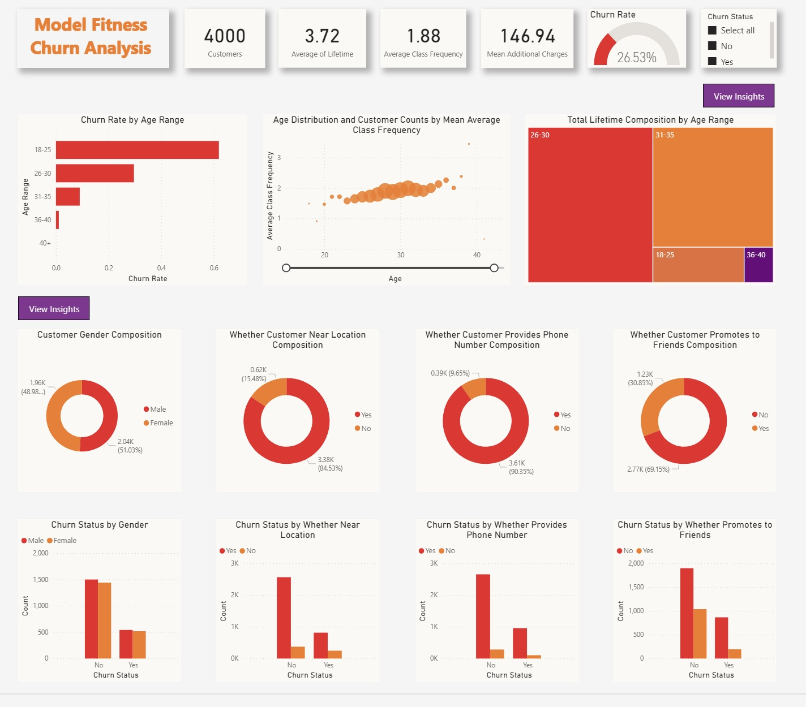

# Model Fitness Gym Customer Churn Analysis 🏃

### Overview 
The project is to analyze a dataset with 4000 lines of customer churn data from a fictional gym called Model Fitness. Using PowerBI, an interactive dashboard is developed to pinpoint trends, patterns, and factors influencing customer attrition. The end goal is to extract insights to for the gym management to make informed deicions and implement strategies to mitigate churn and enhance customer rentention. 

### Data Overview 
The data is collected from Kaggle.com and can be access [here](https://www.kaggle.com/datasets/ellanihill/model-fitness-customer-churn), It contains 13 features: gender, whether the customer lives near the gym location, partner, whether promotes the gym to friends, whether provides a phone number, contract period, whether does group visits, age, average additional charges, month to end contract, lifetime, average class frequency, average class frequency of current month.   

### Key Concepts 
**Churn rate**: The attrition rate, also known as customer churn rate, represents the rate at which customers discontinue their engagement with a particular entity. It can be calculated using the formula: Churn rate = customers lost / total number of customers. 

### Visualization 
#### Dashboard Design 
My design strategy revolved around user-friendliness and actionable insights. I decided to maintain a consistent off-white background color scheme and red/orange colors for graphs to ensure a professional and engaging look.
#### Data Cleaning and Manipulation 
Data was cleaned and manipulated using PowerQuery in Microsoft Excel and Data Analysis Expressions (DAX) in PowerBI. 
#### Key Visualizations
- Number Cards: The number cards on the top of the dashboard provide an overview of key metrics, including total customer count, overall churn rate (along with a gauge chart), average lifetime, mean additional charges, and average class frequency.
- Bar chart: The bar chart compares the churn rate of different age range groups and ranks the groups from the highest churn rate to the lowest.
- Scatter plot: The scatter plot shows the mean average class frequency of members of different ages, with the size of the bubble indicating the count of members of each age. 
- Treemap: The treemap shows the contribution of members from each age range to the total lifetime value. 
- Donut Charts: Donut charts illustrate the proportion of specific categories, like gender composition, within the dataset.
- Clustered Bar Charts: Bar charts compare category distributions between churn statuses, showing metrics like how many churned customers promoted the gym to friends versus those who did not.
- Interactivity: Users can engage with the dashboard by applying filters to observe how numbers and graphs adjust for both churned and non-churned segments. Users can also zoom in and out on the scatter plot to view class frequency and member count information for different age ranges by selecting the age range using the slider at the bottom of the graph. 

#### PowerBI Dashboard 
Here is the finished dashboard:

 
Here is a demo of the finished dashboard:  

#### Key Findings
- Customers who do not churn take classes more frequently on an average basis.
- Customers who do not churn pay more additional charges.
- Most customers of the gym are between 25 and 35 years old.
- Customers within the age range of 18-25 have the highest churn rate of 62% among all the age groups.
- Customers within the age range of 26-30 contributed the most lifetime value.
- Proportionally, less churned customers promote/recommend the gym to their friends than those who did not churn.
- Whether the customer provides phone number doesn't significantly impact churn decisions.
- Gender doesn't notably influence churn decisions. 

#### Actionable Items 
- Enhance Engagement: Develop strategies to increase class attendance among all customers, with personalized offerings and incentives for regular attendees.
- Customer Value Enhancement: Focus on extending customer lifetime value by providing tailored services, exclusive benefits, and loyalty programs for long-term members.
- Strengthen Referral Programs: Implement initiatives to encourage more churned customers to refer the gym to their friends, leveraging word-of-mouth marketing to boost retention.
